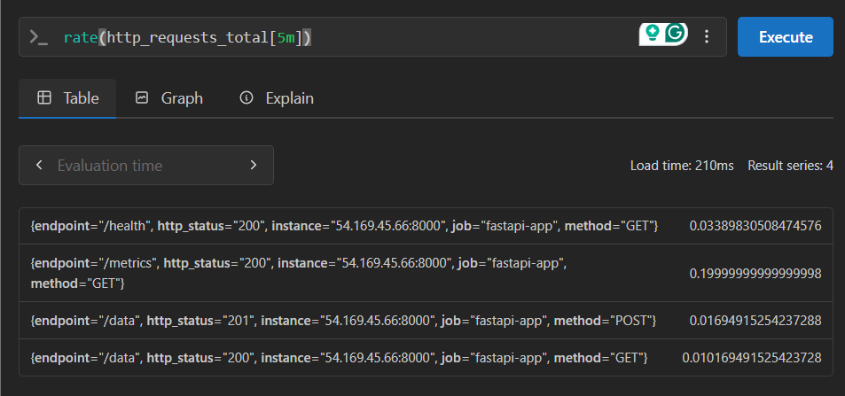
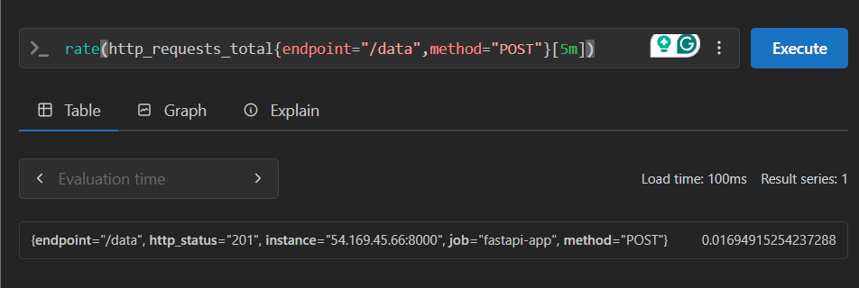
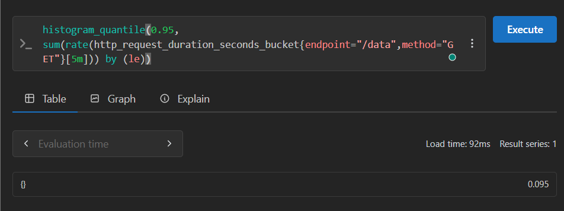
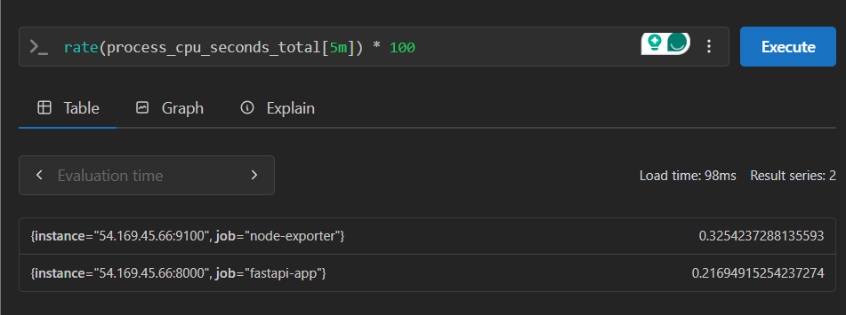
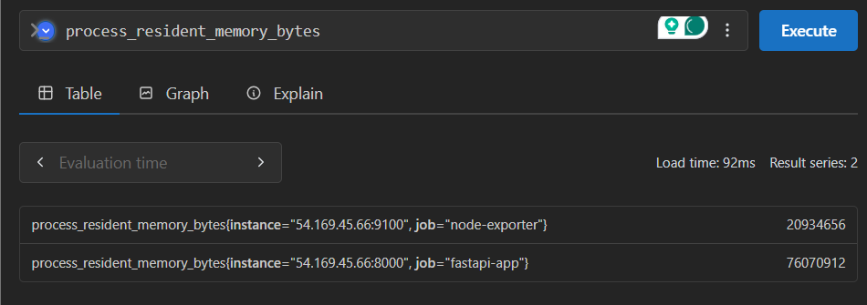
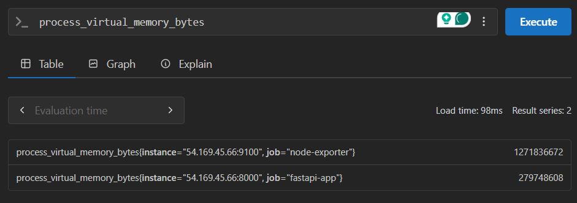
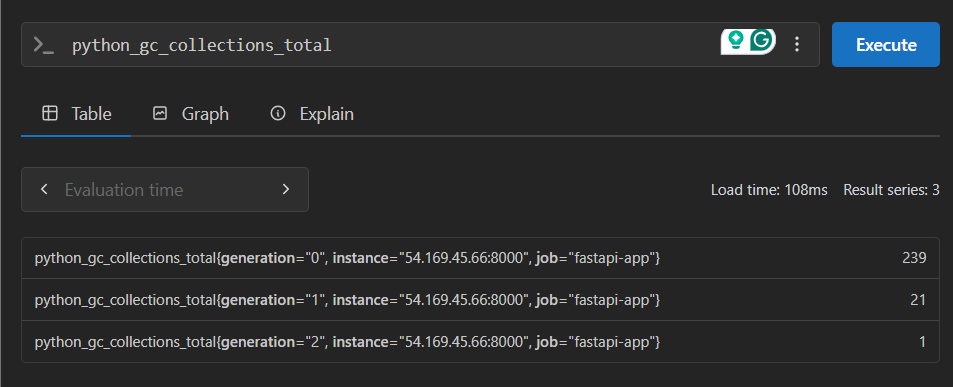
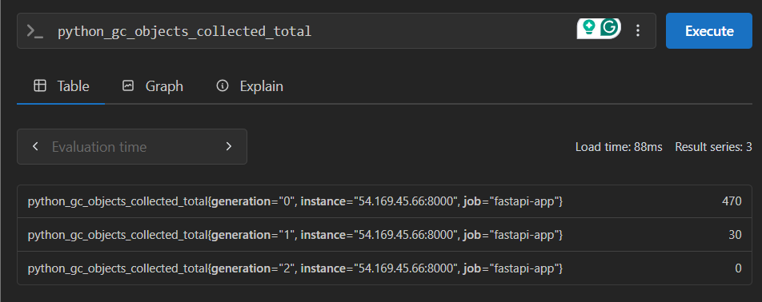

# Application & System Monitoring - PromQL Query Guide


This document provides detailed explanations of the 8 non-database PromQL queries used in the FastAPI monitoring lab. These queries cover HTTP performance, system resources, and application-level metrics.


## 1. Global Request Rate

### PromQL Query
```promql
rate(http_requests_total[5m])
```



### PromQL Explanation
- **`http_requests_total`**: Counter metric tracking all HTTP requests with method, endpoint, and http_status labels
- **No label filters**: Aggregates requests across all FastAPI endpoints (/data, /health, /metrics)
- **`[5m]`**: Time range selector for 5-minute window
- **`rate()`**: Calculates per-second average rate of increase

### How it's calculated
```
Global_Rate = Σ(HTTP_Requests_Current - HTTP_Requests_5min_ago) / 300_seconds
```

### Numerical Example
If the HTTP request counter increased from 780 to 1,560 over 5 minutes (300 seconds), the rate would be: (1,560 - 780) ÷ 300 = 2.6 requests per second.

### What it means
This metric shows the overall traffic volume to your FastAPI application. It includes requests to all endpoints: /data (UserData CRUD), /health (health checks), and /metrics (Prometheus scraping). High rates indicate active user engagement, while low rates may suggest application underutilization or potential connectivity issues.

### Business Metrics Correlation
- **User Activity**: Direct indicator of application usage
- **Traffic Patterns**: Shows daily/weekly usage cycles
- **Capacity Planning**: Foundation for scaling decisions


## 2. POST /data Request Rate

### PromQL Query
```promql
rate(http_requests_total{endpoint="/data",method="POST"}[5m])
```



### PromQL Explanation
- **`http_requests_total`**: Same counter metric as global rate
- **`{endpoint="/data",method="POST"}`**: Label selectors for UserData creation endpoint
- **Focused Monitoring**: Isolates data creation operations on UserData table
- **Business Logic Tracking**: Monitors core application functionality

### How it's calculated
```
POST_Rate = (POST_Count_Now - POST_Count_5min_ago) / 300_seconds
```

### Numerical Example
If the POST /data request counter increased from 1,200 to 1,500 over 5 minutes (300 seconds), the rate would be: (1,500 - 1,200) ÷ 300 = 1.0 POST requests per second.

### What it means
This metric tracks data creation activity in your FastAPI application. Each POST request creates a new UserData record with name, email, and message fields. High POST rates indicate active user engagement and data growth, requiring attention to write performance and storage capacity planning.

### Business Intelligence Applications
- **User Engagement**: Measures active content creation
- **Feature Usage**: Tracks adoption of data entry features
- **Conversion Metrics**: Can correlate with business KPIs


## 3. GET /data 95th Percentile Latency

### PromQL Query
```promql
histogram_quantile(0.95, sum(rate(http_request_duration_seconds_bucket{endpoint="/data",method="GET"}[5m])) by (le))
```



### PromQL Explanation
- **`http_request_duration_seconds_bucket`**: Histogram metric with latency buckets for GET requests
- **`{endpoint="/data",method="GET"}`**: Filters for UserData retrieval endpoint
- **`rate(...[5m])`**: Rate of samples in each histogram bucket over 5 minutes
- **`sum(...) by (le)`**: Aggregates across instances, grouped by bucket upper bounds
- **`histogram_quantile(0.95, ...)`**: Calculates 95th percentile latency

### How it's calculated
```
P95 = Bucket_Lower_Bound + ((0.95 × Total_Count - Count_Below) / Count_In_Bucket) × Bucket_Width
```

### Numerical Example
If the GET /data request latency histogram shows 1,430 total requests distributed across buckets (800 in 0-100ms, 400 in 100-300ms, 150 in 300-500ms, 50 in 500-1000ms, 30 in 1000-3000ms), the 95th percentile would be: 0.3 + ((0.95 × 1430 - 1200) ÷ 150) × 0.2 = 0.512 seconds (512ms).

### What it means
This metric reveals the performance of data retrieval operations in your FastAPI application. The GET /data endpoint fetches UserData records with optional pagination (skip/limit parameters). Values under 100ms provide excellent user experience, while values over 300ms may indicate the need for query optimization or database indexing improvements.

### User Experience Impact
- **Excellent**: < 100ms (users perceive as instant)
- **Good**: 100-300ms (slight delay, acceptable)
- **Acceptable**: 300ms-1s (noticeable but usable)
- **Poor**: > 1s (significant user frustration)


## 4. CPU Usage Rate

### PromQL Query
```promql
rate(process_cpu_seconds_total[5m]) * 100
```



### PromQL Explanation
- **`process_cpu_seconds_total`**: Counter tracking total CPU time consumed by FastAPI process
- **`rate(...[5m])`**: CPU time consumption rate over 5 minutes
- **`* 100`**: Converts decimal to percentage (0.45 → 45%)
- **Process-Specific**: Only tracks the FastAPI application process

### How it's calculated
```
CPU_Usage% = (CPU_Seconds_Now - CPU_Seconds_5min_ago) / 300_seconds × 100
```

### Numerical Example
If the CPU time counter increased from 125.6 to 261.2 seconds over 5 minutes (300 seconds), the CPU usage would be: (261.2 - 125.6) ÷ 300 × 100 = 45.2% CPU utilization.

### What it means
This metric shows how heavily your FastAPI application is using CPU resources. The application handles UserData CRUD operations, database queries, and HTTP request processing. High CPU usage (>80%) may indicate performance bottlenecks, while very low usage (<10%) might suggest underutilization or potential issues with request processing.

### Performance Interpretation
- **Idle**: 0-20% (application ready for more load)
- **Normal**: 20-60% (healthy utilization under normal traffic)
- **High**: 60-80% (approaching capacity limits)
- **Critical**: 80%+ (performance degradation likely)


## 5. Resident Memory Usage

### PromQL Query
```promql
process_resident_memory_bytes
```



### PromQL Explanation
- **`process_resident_memory_bytes`**: Gauge metric showing physical RAM usage by FastAPI process
- **Resident Set Size (RSS)**: Physical memory currently held in RAM for application
- **No time range**: Instantaneous memory usage snapshot
- **Process-Specific**: Only the FastAPI application's memory footprint

### How it's calculated
```
Resident_Memory = Physical_RAM_Currently_Used_By_FastAPI_Process
```

### Numerical Example
If the FastAPI process is using 134,217,728 bytes of memory, the resident memory usage would be: 134,217,728 ÷ (1024 × 1024) = 128 MB of physical RAM.

### What it means
This metric shows the physical memory consumption of your FastAPI application. The application needs memory for Python runtime, SQLAlchemy ORM, request/response handling, and UserData objects. Sudden increases may indicate memory leaks, while consistent growth suggests the application is handling more data or requests.

### Memory Usage Analysis
```
Memory_MB = Bytes / (1024 × 1024)
Memory_GB = Bytes / (1024 × 1024 × 1024)

Example: 134,217,728 / (1024²) = 128 MB
```


## 6. Virtual Memory Usage

### PromQL Query
```promql
process_virtual_memory_bytes
```



### PromQL Explanation
- **`process_virtual_memory_bytes`**: Gauge showing total virtual address space allocated to FastAPI
- **Virtual Memory**: All memory allocated to process (RAM + swap + unused)
- **Address Space**: Includes memory-mapped files, shared libraries, and Python runtime
- **Always Larger**: Virtual memory ≥ resident memory

### How it's calculated
```
Virtual_Memory = Total_Address_Space_Allocated_To_FastAPI_Process
```

### Numerical Example
If the FastAPI process has allocated 1,073,741,824 bytes of virtual memory and is using 134,217,728 bytes of resident memory, the virtual memory usage would be: 1,073,741,824 ÷ (1024 × 1024) = 1,024 MB (1 GB), with a virtual-to-resident ratio of 8:1 (1024 ÷ 128 = 8).

### What it means
This metric shows the total virtual memory allocated to your FastAPI application. Virtual memory includes physical RAM, swap space, memory-mapped files, and unused allocations. A large virtual memory footprint compared to resident memory may indicate memory fragmentation or the application reserving more space than it currently needs.

### Virtual vs Resident Memory
```
Virtual_Memory = Physical_RAM + Swap_Space + Memory_Mapped_Files + Unused_Allocations
Resident_Memory = Only_Physical_RAM_Currently_Used

Typical_Ratio = Virtual_Memory / Resident_Memory ≈ 3:1 to 10:1
```

### System Health Indicators
- **Normal Growth**: Virtual memory grows with application features
- **Excessive Growth**: May indicate memory fragmentation or leaks
- **Swap Usage**: Virtual >> Physical may cause performance issues
- **32-bit Limits**: Virtual memory capped at ~3-4 GB on 32-bit systems


## 7. GC Collections Total

### PromQL Query
```promql
python_gc_collections_total
```



### PromQL Explanation
- **`python_gc_collections_total`**: Counter tracking Python garbage collection events in FastAPI
- **Cumulative Count**: Total GC cycles since FastAPI process start
- **Python-Specific**: Monitors Python's automatic memory management for UserData objects
- **Performance Indicator**: Frequent GC can impact response times

### How it's calculated
```
GC_Collections = Total_Garbage_Collection_Cycles_Since_Process_Start
```

### Numerical Example
If the FastAPI process has been running for 2.5 hours and has collected 1,247 generation 0 objects, 113 generation 1 objects, and 8 generation 2 objects, the collection rates would be: 1,247 ÷ 2.5 = 498.8 gen-0 collections per hour, 113 ÷ 2.5 = 45.2 gen-1 collections per hour, and 8 ÷ 2.5 = 3.2 gen-2 collections per hour.

### What it means
This metric shows how frequently Python's garbage collector is running in your FastAPI application. The application creates temporary objects for HTTP requests, database queries, and UserData operations. High collection rates may indicate memory pressure or inefficient object creation patterns that could impact performance.

### Optimization Strategies
- **Object Pooling**: Reduce temporary object creation
- **Memory Efficiency**: Use generators and iterators
- **GC Tuning**: Adjust collection thresholds if needed
- **Profiling**: Identify code creating excessive temporary objects


## 8. GC Objects Collected Total

### PromQL Query
```promql
python_gc_objects_collected_total
```



### PromQL Explanation
- **`python_gc_objects_collected_total`**: Counter of objects reclaimed by GC in FastAPI
- **Memory Reclamation**: Shows how much memory is being freed from UserData operations
- **Efficiency Metric**: Objects collected per GC cycle
- **Memory Health**: Indicates application memory usage patterns

### How it's calculated
```
Objects_Collected = Total_Objects_Reclaimed_By_Garbage_Collection
```

### Numerical Example
If the garbage collector has reclaimed 89,234 generation 0 objects, 12,876 generation 1 objects, and 1,543 generation 2 objects across 1,368 total collections, the average objects per collection would be: (89,234 + 12,876 + 1,543) ÷ 1,368 = 75.8 objects per collection.

### What it means
This metric shows how much memory is being reclaimed by Python's garbage collector in your FastAPI application. The application creates temporary objects for HTTP requests, database operations, and UserData processing. High collection rates with low object counts may indicate memory leaks, while high object counts suggest active object creation and destruction patterns.

### Correlation with Other Metrics
```promql
# Memory allocation efficiency
rate(python_gc_objects_collected_total[5m]) / rate(python_gc_collections_total[5m])

# GC impact on response times
rate(python_gc_collections_total{generation="2"}[5m]) vs histogram_quantile(0.95, http_request_duration_seconds_bucket)
```

## Custom FastAPI Application Metrics

### 9. HTTP Request Rate by Status Code

#### PromQL Query
```promql
rate(http_requests_total[5m])
```

#### PromQL Explanation
- **`http_requests_total`**: Counter metric with method, endpoint, and http_status labels
- **`[5m]`**: 5-minute time window for rate calculation
- **`rate()`**: Converts counter increases to per-second rates
- **Status-based filtering**: Can filter by specific HTTP status codes

#### How it's calculated
```
Request_Rate = (Request_Count_Now - Request_Count_5min_ago) / 300_seconds
```

#### Numerical Example
```
http_requests_total{http_status="200"} 1.8
http_requests_total{http_status="201"} 0.6
http_requests_total{http_status="404"} 0.1
http_requests_total{http_status="500"} 0.05
```
- **Total**: 2.55 requests per second with 96% success rate
- **Scenario**: FastAPI application handling user data operations with typical success/failure distribution

#### What it means
This metric shows the health and reliability of your FastAPI application. High rates of 2xx status codes indicate successful operations, while high rates of 4xx/5xx codes suggest client errors or server issues. The UserData CRUD endpoints (/data) should primarily show 200 (GET), 201 (POST), and 404 (not found) status codes.

### 10. HTTP Request Latency by Endpoint

#### PromQL Query
```promql
histogram_quantile(0.95, rate(http_request_duration_seconds_bucket[5m]))
```

#### PromQL Explanation
- **`http_request_duration_seconds_bucket`**: Histogram with method, endpoint, and http_status labels
- **`rate(...[5m])`**: Rate of samples in each bucket over 5 minutes
- **`histogram_quantile(0.95, ...)`**: 95th percentile calculation
- **Endpoint-specific**: Can filter by /data, /health, /metrics endpoints

#### How it's calculated
```
P95_Latency = Interpolated_Value_Where_95%_Of_Requests_Complete_Faster
```

#### Numerical Example
```
{endpoint="/data",method="GET"} 0.185
{endpoint="/data",method="POST"} 0.245
{endpoint="/data",method="PUT"} 0.198
{endpoint="/data",method="DELETE"} 0.156
{endpoint="/health"} 0.045
```
- **Values**: 185ms for GET /data, 245ms for POST /data, 45ms for health check
- **Scenario**: UserData operations with typical latency patterns

#### What it means
This metric reveals the performance characteristics of different endpoints in your FastAPI application. POST operations typically take longer due to database writes, while GET operations are faster. The /health endpoint should be very fast as it only performs a simple database ping. High latency in any endpoint indicates potential performance bottlenecks.

### 11. HTTP Request Rate by Method and Endpoint

#### PromQL Query
```promql
rate(http_requests_total{endpoint="/data"}[5m])
```

#### PromQL Explanation
- **`http_requests_total`**: Counter metric with method and endpoint labels
- **`{endpoint="/data"}`**: Filter for specific endpoint
- **`[5m]`**: 5-minute time window for rate calculation
- **`rate()`**: Converts counter increases to per-second rates

#### How it's calculated
```
Endpoint_Rate = (Request_Count_Now - Request_Count_5min_ago) / 300_seconds
```