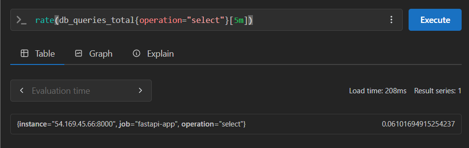
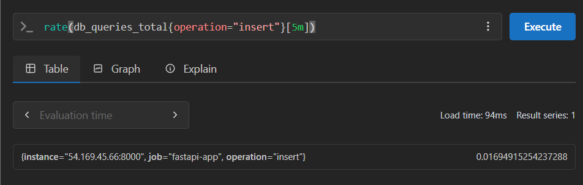
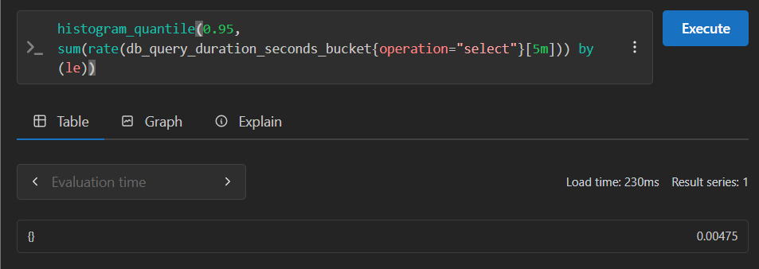
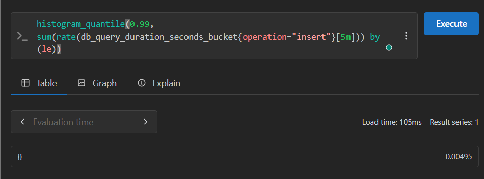
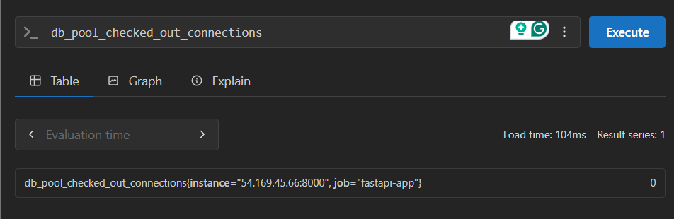
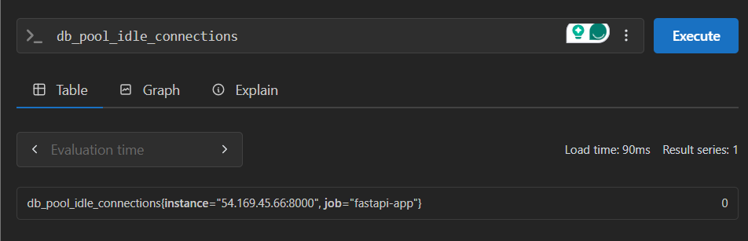
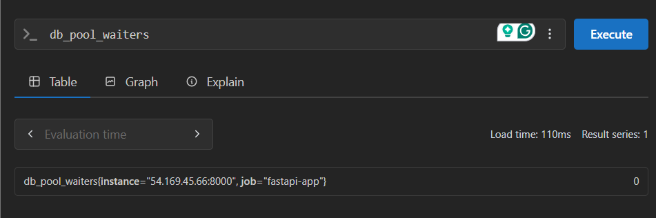

# Database Performance Monitoring - PromQL Query Guide

This document provides a comprehensive explanation of the 7 database-related PromQL queries used in the FastAPI monitoring lab. These queries cover database operations, connection pool management, and query performance analysis.


## 1. SELECT Query Rate

### PromQL Query
```promql
rate(db_queries_total{operation="select"}[5m])
```



Go to `Explain` tab to see details. 

### PromQL Explanation
- **`db_queries_total`**: Counter metric tracking total database queries with operation labels
- **`{operation="select"}`**: Label selector filtering only SELECT operations from UserData table
- **`[5m]`**: Time range selector for the last 5 minutes
- **`rate()`**: Function calculating the per-second average rate of increase

### How it's calculated
```
SELECT_Rate = (SELECT_Count_Now - SELECT_Count_5min_ago) / 300_seconds
```

### Numerical Example
If the SELECT query counter increased from 1,200 to 1,920 over 5 minutes (300 seconds), the rate would be: (1,920 - 1,200) ÷ 300 = 2.4 SELECT queries per second.

### What it means
This metric shows how frequently your FastAPI application is reading UserData from the database. High SELECT rates indicate active data retrieval, typically from the GET /data endpoint. This helps understand user engagement and whether read replicas might be needed for better performance.

## 2. INSERT Query Rate

### PromQL Query
```promql
rate(db_queries_total{operation="insert"}[5m])
```



### PromQL Explanation
- **`db_queries_total`**: Same counter metric as SELECT queries
- **`{operation="insert"}`**: Label selector for INSERT operations on UserData table
- **`[5m]`**: 5-minute time window for rate calculation
- **`rate()`**: Converts counter increases to per-second rates

### How it's calculated
```
INSERT_Rate = (INSERT_Count_Now - INSERT_Count_5min_ago) / 300_seconds
```

### Numerical Example
If the INSERT query counter increased from 450 to 690 over 5 minutes (300 seconds), the rate would be: (690 - 450) ÷ 300 = 0.8 INSERT queries per second.

### What it means
This metric tracks data creation activity in your FastAPI application. Each INSERT corresponds to a new UserData record being created through the POST /data endpoint. High INSERT rates indicate active user engagement and data growth, requiring attention to write performance and storage capacity.

## 3. SELECT 95th Percentile Latency

### PromQL Query
```promql
histogram_quantile(0.95, sum(rate(db_query_duration_seconds_bucket{operation="select"}[5m])) by (le))
```



### PromQL Explanation
- **`db_query_duration_seconds_bucket`**: Histogram metric with latency buckets for SELECT operations
- **`{operation="select"}`**: Filter for SELECT operation latencies on UserData table
- **`rate(...[5m])`**: Calculate rate of samples in each bucket over 5 minutes
- **`sum(...) by (le)`**: Aggregate across all instances, grouped by bucket upper bounds
- **`histogram_quantile(0.95, ...)`**: Calculate the 95th percentile from histogram

### How it's calculated
```
P95 = Bucket_Lower_Bound + ((0.95 × Total_Count - Count_Below) / Count_In_Bucket) × Bucket_Width
```

### Numerical Example
If the SELECT query latency histogram shows 1,500 total queries distributed across buckets (800 in 0-10ms, 400 in 10-25ms, 200 in 25-50ms, 100 in 50-100ms), the 95th percentile would be: 0.025 + ((0.95 × 1500 - 1200) ÷ 200) × 0.025 = 0.053 seconds (53ms).

### What it means
This metric reveals the performance of data retrieval operations in your FastAPI application. The GET /data endpoint performance directly impacts user experience. Values under 50ms are excellent, while values over 200ms may indicate the need for query optimization or database indexing improvements.

## 4. INSERT 99th Percentile Latency

### PromQL Query
```promql
histogram_quantile(0.99, sum(rate(db_query_duration_seconds_bucket{operation="insert"}[5m])) by (le))
```



### PromQL Explanation
- **`histogram_quantile(0.99, ...)`**: Calculates 99th percentile instead of 95th for INSERT operations
- **Same base components**: Uses INSERT operation filter for UserData table
- **Higher Precision**: 99th percentile captures more extreme latency cases

### How it's calculated
```
P99 = Bucket_Lower_Bound + ((0.99 × Total_Count - Count_Below) / Count_In_Bucket) × Bucket_Width
```

### Numerical Example
If the INSERT query latency histogram shows 400 total queries distributed across buckets (200 in 0-50ms, 150 in 50-100ms, 30 in 100-250ms, 15 in 250-500ms, 5 in 500-1000ms), the 99th percentile would be: 0.5 + ((0.99 × 400 - 395) ÷ 5) × 0.5 = 0.6 seconds (600ms).

### What it means
This metric is critical for understanding write performance in your FastAPI application. INSERT operations through the POST /data endpoint are typically slower than SELECTs due to transaction overhead. High P99 values (>1s) indicate serious write performance issues that could affect user experience and data consistency.

## 5. Checked-out Connections

### PromQL Query
```promql
db_pool_checked_out_connections
```



### PromQL Explanation
- **`db_pool_checked_out_connections`**: Gauge metric showing active database connections
- **No time range**: Current snapshot of connections in use by FastAPI application
- **Direct measurement**: No mathematical transformation needed

### How it's calculated
```
Checked_Out_Connections = Active_Database_Connections_Currently_In_Use
```

### Numerical Example
If the database connection pool has 20 total connections and 8 are currently in use, the checked-out connections would be: 8 connections, representing 40% pool utilization (8 ÷ 20 × 100 = 40%).

### What it means
This metric shows how heavily your FastAPI application is using the database connection pool. Each active request to /data endpoints may hold a connection. High utilization suggests the application is under load, while very high values might indicate connection leaks or insufficient pool size.

## 6. Idle Connections

### PromQL Query
```promql
db_pool_idle_connections
```



### PromQL Explanation
- **`db_pool_idle_connections`**: Gauge showing available connections in the pool
- **Instantaneous Value**: Current count of unused connections ready for FastAPI requests
- **Ready State**: These connections are established and ready for immediate use

### How it's calculated
```
Idle_Connections = Available_Database_Connections_In_Pool
```

### Numerical Example
If the database connection pool has 20 total connections, 8 are checked out, and 12 are idle, the idle connections would be: 12 connections, representing 60% available capacity (12 ÷ 20 × 100 = 60%).

### What it means
This metric ensures your FastAPI application has sufficient database connections available for new requests. Adequate idle connections prevent request queuing and maintain good response times. Too few idle connections may cause performance bottlenecks during traffic spikes.

## 7. Connection Waiters

### PromQL Query
```promql
db_pool_waiters
```



### PromQL Explanation
- **`db_pool_waiters`**: Gauge showing queued connection requests
- **Queue Depth**: Number of FastAPI requests waiting for database connections
- **Performance Bottleneck Indicator**: Non-zero values indicate connection pool saturation

### How it's calculated
```
Waiters = Requests_Waiting_For_Database_Connection
```

### Numerical Example
If the database connection pool is at 100% utilization (20/20 connections in use) and 3 requests are waiting for connections, the waiters would be: 3 requests, with an estimated additional latency of 150ms per request (assuming 50ms average connection usage time × 3 waiters = 150ms).

### What it means
This metric is critical for identifying connection pool bottlenecks in your FastAPI application. Non-zero values indicate that requests to /data endpoints are queuing due to insufficient database connections. This directly impacts user experience and should trigger immediate scaling or optimization actions.


## 8. In-Progress Requests

### PromQL Query
```promql
inprogress_requests
```

### PromQL Explanation
- **`inprogress_requests`**: Gauge metric tracking currently active HTTP requests
- **Real-time snapshot**: Shows instantaneous count of requests being processed
- **No time range**: Direct measurement of current application load

### How it's calculated
```
In_Progress_Count = Active_HTTP_Requests_Currently_Processing
```
The metric is incremented when a request starts and decremented when it completes.

### Numerical Example
```
inprogress_requests 5
```
- **Value**: 5 requests currently being processed
- **Scenario**: During a traffic spike, 5 users are simultaneously accessing the application

### What it means
This metric indicates the current concurrency level of your FastAPI application. A high number suggests the application is under load, while zero indicates no active requests. This is particularly useful for understanding database connection pool utilization patterns, as each in-progress request may hold a database connection.

## 9. Database Query Rate by Operation Type

### PromQL Query
```promql
rate(db_queries_total[5m])
```

### PromQL Explanation
- **`db_queries_total`**: Counter metric with operation labels (select, insert, update, delete)
- **`[5m]`**: 5-minute time window for rate calculation
- **`rate()`**: Converts counter increases to per-second rates
- **Label-based**: Can filter by specific operations

### How it's calculated
```
Query_Rate = (Query_Count_Now - Query_Count_5min_ago) / 300_seconds
```

### Numerical Example
```
db_queries_total{operation="select"} 2.4
db_queries_total{operation="insert"} 0.8
db_queries_total{operation="update"} 0.3
db_queries_total{operation="delete"} 0.1
```
- **Total**: 3.6 queries per second across all operations
- **Scenario**: Application handling user data CRUD operations with typical read-heavy workload

### What it means
This metric shows the database query patterns specific to your FastAPI application. The UserData model operations (create, read, update, delete) are tracked separately, allowing you to understand which operations are most frequent and potentially optimize accordingly. High SELECT rates indicate read-heavy workloads, while high INSERT/UPDATE rates suggest active data modification.

## 10. Database Query Duration by Operation

### PromQL Query
```promql
histogram_quantile(0.95, rate(db_query_duration_seconds_bucket[5m]))
```

### PromQL Explanation
- **`db_query_duration_seconds_bucket`**: Histogram with operation labels
- **`rate(...[5m])`**: Rate of samples in each bucket over 5 minutes
- **`histogram_quantile(0.95, ...)`**: 95th percentile calculation
- **Operation-specific**: Can filter by select, insert, update, delete

### How it's calculated
```
P95_Duration = Interpolated_Value_Where_95%_Of_Queries_Complete_Faster
```

### Numerical Example
```
{operation="select"} 0.045
{operation="insert"} 0.125
{operation="update"} 0.098
{operation="delete"} 0.067
```
- **Values**: 45ms for SELECT, 125ms for INSERT, 98ms for UPDATE, 67ms for DELETE
- **Scenario**: UserData table operations with typical performance characteristics

### What it means
This metric reveals the performance characteristics of different database operations in your FastAPI application. INSERT operations typically take longer due to transaction overhead, while SELECT operations are usually fastest. High latency in any operation type indicates potential database performance issues that could affect user experience.

This comprehensive analysis of database monitoring queries provides the foundation for maintaining high-performance database operations in production FastAPI applications.